<!-- ===================== HEADER ===================== -->
<div align="center">



<a href="https://github.com/MoZainUlAbideen">
 
</a>

<br/>


<br/><br/>

<a href="https://www.linkedin.com/in/muhammad-zain-ul-abideen-nust/"></a>
<a href="https://rehnuma-kappa.vercel.app"></a>
<a href="https://m-zain-ul-abideen-portfolio.vercel.app/"></a>

<br/><br/>


</div>

---

<!-- ===================== ABOUT ===================== -->
<div align="center"><h2>👨‍💻 About Me</h2></div>

I'm **Zain**, an **AI Full Stack Engineer** and Electrical Engineering graduate from **NUST (CEME)**. I build LLM products end-to-end — ingestion and retrieval, agents, evaluation, a deployed backend and a polished frontend — and I care most about one thing: **proving the system actually works**. Every project I ship has real tests, an eval harness with honest metrics, and bugs that were diagnosed, not guessed at.

- 🤖 **RAG & Agentic Systems** — multi-agent routing, cited answers, critic/drafter loops, layered conversational memory.
- 📏 **Evaluation-First Engineering** — golden sets, deterministic + LLM-as-judge grading, regression tracking, CI eval gates.
- 🧱 **Full Stack Delivery** — Python/FastAPI backends in Docker on Render, web frontends on Vercel, live rate-limited demos.
- 🇵🇰 **AI for Local Problems** — Urdu-first copilots built around Pakistan's power sector and NEPRA regulations.
- 📡 **Hardware + ML Roots** — ESP32 → Raspberry Pi sensor pipelines and ensemble ML for underground vehicle classification.

> **Open To:** AI Full Stack Engineer • AI / LLM Engineer • ML Engineer • Full-time & Remote Roles

---

<!-- ===================== TECH STACK ===================== -->
<div align="center"><h2>🛠️ Tech Stack</h2></div>

<div align="center">

**Languages & Frontend**


**Backend & LLMs**


**ML & Computer Vision**


**Deploy, Cloud & Tooling**


**Embedded & Hardware**


</div>

---

<!-- ===================== EXPERTISE ===================== -->
<div align="center"><h2>🧠 Expertise</h2></div>

| Domain | Proficiency | Details |
| :--- | :---: | :--- |
| **Retrieval-Augmented Generation** | ████████░░ Advanced | EdgarIQ (page-level citations over SEC filings), GPU Scout (FAISS + Ollama), Rehnuma's NEPRA policy guide, role-filtered retrieval in Chroma |
| **LLM Evaluation** | ████████░░ Advanced | Golden sets, deterministic + LLM-as-judge grading, regression tracking, HTML reports, CI eval gate — EdgarIQ pass rate 29% → 100% |
| **Multi-Agent Systems** | ████████░░ Advanced | Two-stage keyword + LLM router over 5 expert agents; drafter/critic loop with numeric fact checking; Rehnuma's query router |
| **Full Stack AI Delivery** | ███████░░░ Proficient | Python/FastAPI backends in Docker on Render, frontends on Vercel, per-visitor rate limiting on live demos |
| **Classical ML & Signal Processing** | ███████░░░ Proficient | Ensemble KNN/LDA/RF/SVM/Extra Trees on sensor features (71% → 99%), IEEE-format paper; CFAR & Pulse-Doppler radar in MATLAB |
| **Vision & Document AI** | ██████░░░░ Intermediate | Gemini-powered bill photo extraction (Rehnuma); vision agent for accessibility auditing (Parity) |
| **LLMOps** | ██████░░░░ Intermediate | Langfuse tracing, CI eval gate, NEPRA policy-change watcher, free-tier quota protection |
| **Computer Vision** | █████░░░░░ Intermediate | YOLOv8 crash detection, OpenCV parking-slot, gesture and face-blurring projects |
| **Embedded & Edge AI** | ██████░░░░ Intermediate | ESP32-S3 sensor node → UART → Raspberry Pi feature extraction and on-device classification |

---

<!-- ===================== FEATURED PROJECTS ===================== -->
<div align="center"><h2>🚀 Featured Projects</h2></div>

<details open>
<summary><b>⚡ Rehnuma (رہنما) — Electricity Bill Audit & Power Guide Copilot for Pakistan</b></summary>

<br/>

An Urdu-first AI copilot that reads Pakistani electricity bills (PESCO, IESCO), audits every charge against official slabs and levies, explains the bill in plain language, and answers questions about NEPRA policy and solar net metering.

| Attribute | Detail |
| :--- | :--- |
| **Stack** | Python, Groq, Gemini (vision), Docker, Render, Vercel, Langfuse, GitHub Actions |
| **Scope** | Bill reconciliation engine, slab & levy calculator, photo extraction, NEPRA policy guide + router, usage forecast & solar outlook |
| **Evaluation** | Ground-truth labels from real bills, synthetic bill generator, auditor eval, CI eval gate |
| **Users** | Shaped by neighbourhood interviews — solar and non-solar households tested the Urdu summaries |
| **Live** | [rehnuma-kappa.vercel.app](https://rehnuma-kappa.vercel.app) |
| **Repository** | [rehnuma](https://github.com/MoZainUlAbideen/rehnuma) |

Typed Urdu by default with an English toggle, because most people just want someone to explain their bill. Next up: Urdu voice input and a WhatsApp channel.

</details>

<details>
<summary><b>📈 EdgarIQ — Multi-Agent RAG Copilot over SEC Filings</b></summary>

<br/>

A grounded research assistant over SEC EDGAR 10-K / 10-Q / 8-K filings that answers multi-year financial questions with citations to the exact source pages.

| Attribute | Detail |
| :--- | :--- |
| **Stack** | Python, Ollama (`nomic-embed-text`), Groq, pytest, Vercel |
| **Pipeline** | Live SEC ingestion → date-aware retrieval → drafter agent → critic agent → numeric checker |
| **Evaluation** | Human-verified golden set; deterministic + LLM-judge grading; regression tracking; HTML report |
| **Results** | Golden-set pass rate **29% → 86% → 100%** by fixing wrong-quarter retrieval, rate limits & encoding bugs · **89 tests passing** |
| **Repository** | [Edgar_iq](https://github.com/MoZainUlAbideen/Edgar_iq) · [Edgar_iq-web](https://github.com/MoZainUlAbideen/Edgar_iq-web) |

Found and fixed a critic/drafter context mismatch and a calendar-year false positive in the numeric checker — the kind of bugs you only see when you measure.

</details>

<details>
<summary><b>♿ Parity — AI Web Accessibility (WCAG) Auditor & Fixer</b></summary>

<br/>

Opens a page in a real browser, finds WCAG accessibility issues, explains them in plain language and proposes fixes — combining a rule engine with a vision agent.

| Attribute | Detail |
| :--- | :--- |
| **Stack** | Python, axe-core, Gemini (vision agent), Render, Vercel |
| **Pipeline** | Crawler → axe engine → vision agent → explanation & fix generation |
| **Evaluation** | Labeled benchmark with a baseline eval |
| **Live** | [parity-iota-puce.vercel.app](https://parity-iota-puce.vercel.app) |
| **Repository** | [Parity](https://github.com/MoZainUlAbideen/Parity) |

</details>

<details>
<summary><b>🎮 GPU Scout — Multi-Agent RAG System for GPU Recommendations</b></summary>

<br/>

A conversational multi-agent system that recommends GPUs for gaming, AI workloads and professional use, rebuilt end-to-end from a broken prototype.

| Attribute | Detail |
| :--- | :--- |
| **Stack** | Python, FAISS, Ollama embeddings, Groq (Llama 3.1), SQLite, Streamlit |
| **Architecture** | Two-stage keyword + LLM router → 5 expert agents (specs, gaming, AI, hardware, professional) |
| **Memory** | Layered session memory + persistent SQLite memory |
| **Evaluation** | 50-case grounded golden set, LLM-as-judge scoring, regression detection, styled HTML report |
| **Repository** | [GPU_Scout_with_memory](https://github.com/MoZainUlAbideen/GPU_Scout_with_memory) |

</details>

<details>
<summary><b>📡 Multi-Sensor Underground Vehicle Classification (Final Year Project)</b></summary>

<br/>

An edge AI sensor node that classifies passing vehicles as **LTV / HTV / No Vehicle** from vibration, magnetic and acoustic signals.

| Attribute | Detail |
| :--- | :--- |
| **Stack** | ESP32-S3, Raspberry Pi, Python, scikit-learn |
| **Pipeline** | ESP32-S3 node streams over UART → Raspberry Pi feature extraction (9-D vectors) → ensemble classifier |
| **Models** | KNN, LDA, Random Forest, SVM, Extra Trees |
| **Results** | Accuracy improved from **71% → 99%** after outdoor data collection & feature engineering |
| **Research** | Authored an IEEE-format paper on the feature-extraction method |
| **Repository** | [Underground_Vehicle_Detection_System-FYP-](https://github.com/MoZainUlAbideen/Underground_Vehicle_Detection_System-FYP-) |

</details>

<br/>

<details>
<summary><b>📚 More Projects (click to expand)</b></summary>

<br/>

| Project | Domain | What it does |
| :--- | :--- | :--- |
| [**Job Assistant — AI Resume-Fit Dashboard**](https://github.com/MoZainUlAbideen/Job-Assistant-An-AI-Resume-Fit-Dashboard-Built-From-Scratch-FastAPI-Groq-RAG) | Full Stack AI | Scores how well a resume fits a role and surfaces skill gaps — FastAPI, Groq, RAG |
| [**3D Arena Portfolio**](https://github.com/MoZainUlAbideen/M-Zain-ul-Abideen-Portfolio) | Web / 3D | Drive a car around a 3D football arena in the browser — [live](https://m-zain-ul-abideen-portfolio.vercel.app/) |
| [**Production-RAG**](https://github.com/MoZainUlAbideen/Production-RAG) | RAG Learning | My AI engineering notebook, incl. a login-gated RAG with role-based retrieval (Chroma) |
| [**Car Crash Detection**](https://github.com/MoZainUlAbideen/Car-Crash-detection-using-yolov8) | Computer Vision | Accident detection on video with YOLOv8 |
| [**Parking Slot Detection**](https://github.com/MoZainUlAbideen/Parking-slot-detection-using-Computer-Vision) | Computer Vision | Free/occupied parking spot monitoring with OpenCV |
| [**Hand Gesture Recognition**](https://github.com/MoZainUlAbideen/Hand_Gestures_Recognition) | Computer Vision | Real-time hand gesture recognition |
| [**Face Recognition & Blurring**](https://github.com/MoZainUlAbideen/FaceRecognition-and-Blurring) | Computer Vision | Real-time face recognition with privacy blurring in OpenCV |
| [**E-commerce Recommendation System**](https://github.com/MoZainUlAbideen/Ecommerce_Recomendation_system_Machine_Learning) | RecSys | ML-based product recommendations |
| [**Movie Recommendation System**](https://github.com/MoZainUlAbideen/Movies_Recommendation_Using_Python_System) | RecSys | Content-based movie recommender |
| [**Fake News Prediction**](https://github.com/MoZainUlAbideen/Fake_News_Prediction) | NLP | Classifies news articles as real or fake |
| [**Image Classification**](https://github.com/MoZainUlAbideen/ImageClassification_MLProject) | Deep Learning | Categorises images into predefined classes |
| [**DSA in Python**](https://github.com/MoZainUlAbideen/DSA_Python) | Algorithms | Ongoing LeetCode practice |

</details>

---

<!-- ===================== EXPERIENCE ===================== -->
<div align="center"><h2>💼 Experience</h2></div>


### Machine Learning Intern — **Summer 2025** — `RISETech, Islamabad`


### AI/ML Intern — **Summer 2024** — `Software Productivity Strategists (SPS), NSTP, Islamabad`


### Backend Developer — `Upwork`

### `Community:` **Collaborations Team Lead — WWF-Pakistan** (remote) 

---

<!-- ===================== EDUCATION ===================== -->
<div align="center"><h2>🎓 Education</h2></div>

| Institution | Qualification | Period |
| :--- | :--- | :--- |
| **NUST — College of Electrical & Mechanical Engineering (CEME)** | Bachelor of Electrical Engineering | Graduated June 2026 |
| **The City School** | Junior High/Intermediate/Middle School Education | 2009 - 2021 |


---

<!-- ===================== CERTIFICATIONS ===================== -->
<div align="center"><h2>📜 Certifications</h2></div>

<div align="center">


</div>

---

<!-- ===================== GITHUB ANALYTICS ===================== -->
<div align="center"><h2>📊 GitHub Analytics</h2></div>

<div align="center">


<br/><br/>


</div>

---

<!-- ===================== CURRENT FOCUS ===================== -->
<div align="center"><h2>🎯 Current Focus</h2></div>

```yaml
zain:
  building:   ["Rehnuma v2 — Urdu voice + WhatsApp", "Evaluation-first LLM copilots"]
  learning:   ["Production LLMOps", "Google Cloud ML", "Agent reliability"]
  practicing: ["DSA in Python", "System design for AI apps"]
  open_to:    ["AI Full Stack Engineer", "AI / LLM Engineer", "ML Engineer"]
```

---

<!-- ===================== FOOTER ===================== -->
<div align="center">

<a href="https://www.linkedin.com/in/muhammad-zain-ul-abideen-nust/"></a>
<a href="https://m-zain-ul-abideen-portfolio.vercel.app/"></a>

<br/><br/>

<i>"If you can't measure it, you can't trust it — building AI that proves it works."</i>


</div>
